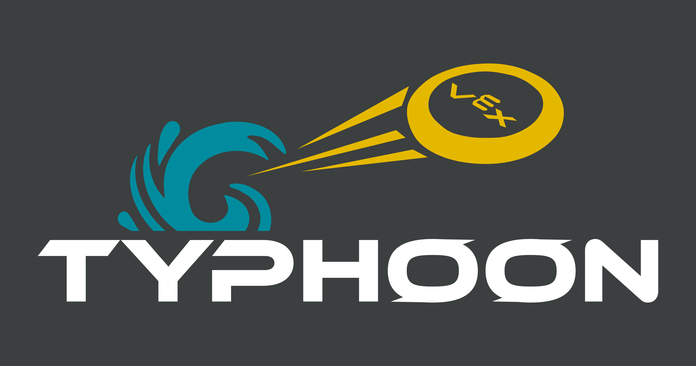

# 3260S VEX 2023 Code

This repository contains our code for this year's VEX game (Spin Up).

## Localization Overview (WIP)
We currently plan for our robot to be able to make shots the full length of the field, using a 1 motor flywheel. In order to accomplish this, our robot needs to know where it is so it can adjust it's heading and change flywheel speeds. We plan to combine information from a vision sensor (distance to goal, angle from goal), IMU (heading), wheel encoders (odometry), and 2 distance sensors (account for encoder + gyro drift), using a custom Unscented Kalman Filter.

- [x] UKF implementation
- [x] Sensor integration
- [] Robot + sensor model functions
- [] UKF tuning
- [] Align to goal method
